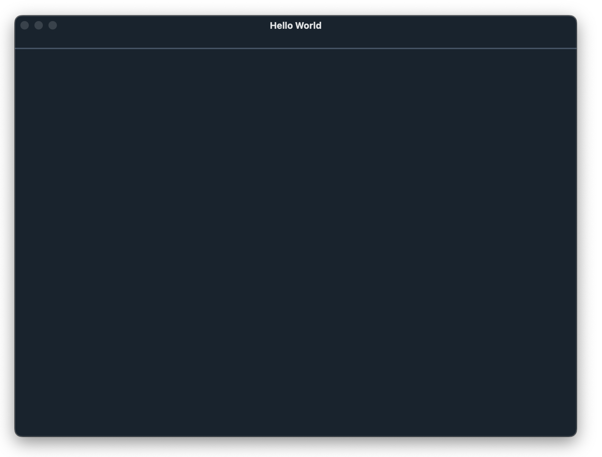
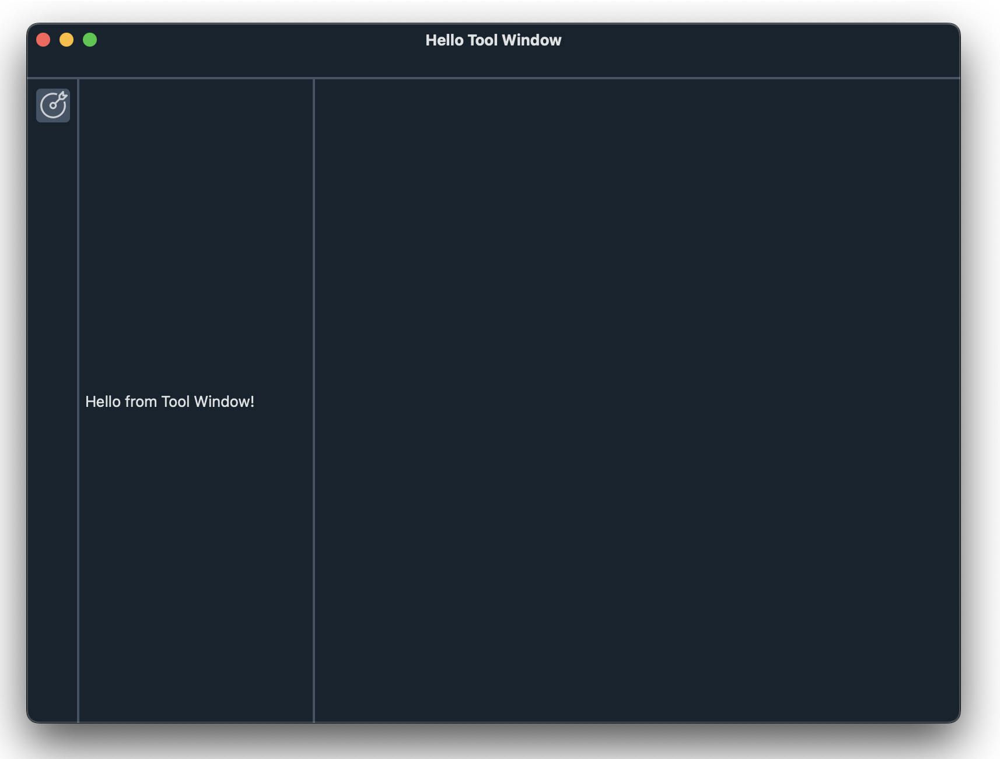
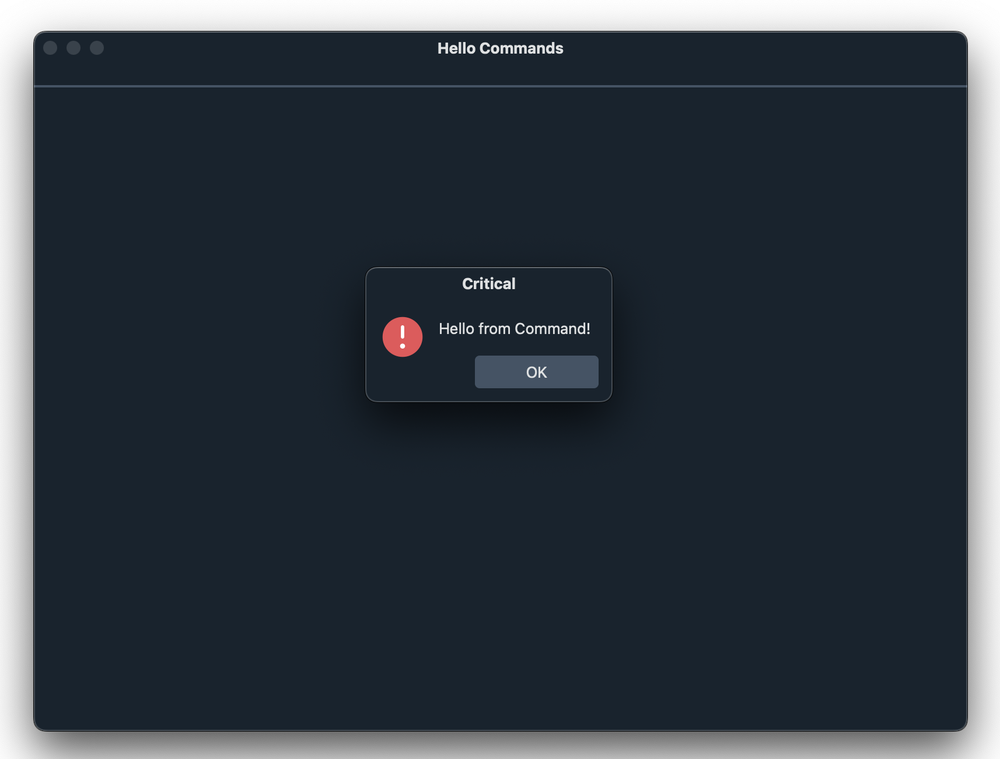
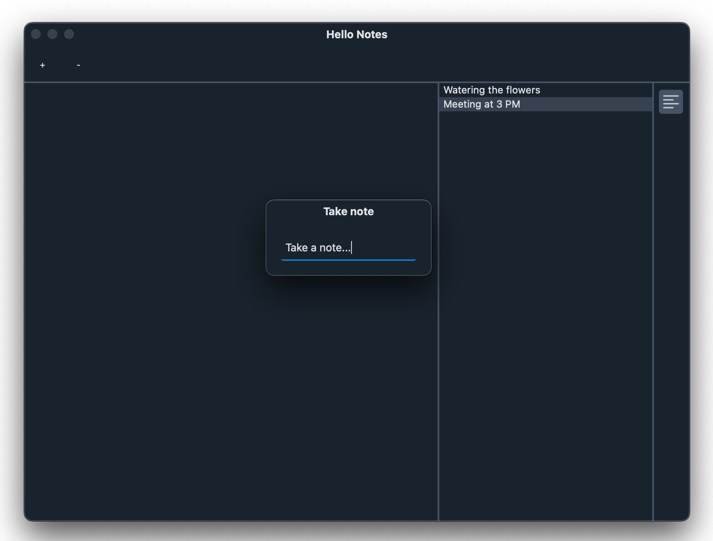

# xSide 开发指南

**目标读者：** 
* xSide 核心开发者、插件开发者、二次集成者
* 开发者需具有 Python + Qt 相关开发知识

**xSide 设计目标：**
* 高度模块化、插件化的 IDE 框架
* 面向长期演进（10+ 年）的稳定内核
* 强调 可测试性、可替换性、最小耦合
* 适合复杂工程工具链（编译 / 调试 / 仿真 / 分析）

---
# 第一部分：整体认知

---
## 1. 总体架构概览

xSide 采用 UI 框架 (qSide)+ 插件模组管理/启动协调器 (xSide) + 插件 (xSide-Plugin/Plugin) + 宿主应用 (Host App) 的四层结构：

其中 UI 框架承担以下职责：
* 提供用户界面可交互的元素/组件
* 提供主要的界面主题样式
* 提供内置 SVG 图标

插件模组管理/启动协调器 (xSide) 承担以下职责：
* App 启动壳（bootstrapping）
* 插件加载与注册入口
* 全局配置 / 日志 / 主题的访问代理

插件 (xSide-Plugin) 承担以下职责：
* 给宿主应用提供服务能力
* 给主窗口提供插件相关的 UI 视图

宿主应用 (Host App):
* 插件黏合剂，形成用户使用目标导向的具体应用

---
## 2. 应用生命周期概览

本章节描述应用从启动到退出的整个过程，包括初始化、运行、挂起、恢复和销毁等阶段。 
开发者应通过阅读本章节理解应用各个状态下应该执行的操作，比如资源初始化、状态保存和清理。

使用 xSide 框架开发的应用程序（后简称 xSide 应用）生命周期大致分为4个阶段。
1. 初始化阶段 - 包括插件扫描步骤和插件运行时初始化步骤
2. 宿主功能集成阶段 - 通过粘合插件能力形成宿主应用
3. 运行时阶段 - 用户操作触发事件驱动的 REPL 循环
4. 清理阶段 - 程序关闭事件触发的现场资源清理、状态保存阶段

用来自 `xCode/main.py` 入口代码作为示例则：
```python
if __name__ == "__main__":
    plugins = xside.findXPlugins()  ←  搜索本地环境内的所有插件
    xside.bootup("2025.09.29.beta", 'xCode', plugins=plugins) ← 插件运行时初始化
    xcode = xCode()  	         ← 宿主应用对象
    xcode.setupWindowTitle()     ← 开始粘合插件能力
    xcode.setupMenuBar()
    xcode.setupStatusBar()
    xcode.setupLayout()
    xcode.registerCommands()
    xside.run()                  ← 进入运行时阶段，主要为 Qt Event Loop 分发用户操作事件

    ←  清理阶段，当 `xside.run()` 返回之时，所有插件的 `shutdown()` 方法被调用，在该方法中插件各自清理现场资源、保存状态。
    exit(0) ← 进程退出
```

---
## 3. 安装

### 3.1 使用已发布的版本

只需在您选择的终端中运行以下命令：

```commandline
pip install qSide xSide xSide-Window
```
其中 xSide-Window 是用于管理窗口的基本插件。

---
## 4. 从 Hello World 开始

本章就从常规的 Hello World 程序开始，拉起来一个纯净的主窗口，并在标题栏上显示 X Hello World!

示例代码：Hello World
```python
#: hello.py
# -*- coding: utf-8 -*-
from xSide import xside

class HelloWorld(object):
    def setupWindowTitle(self):
        xside.window.setMainWindowTitle('Hello World')

if __name__ == "__main__":
    plugins = xside.findXPlugins()
    xside.bootup("0.1.0a", 'Hello', plugins=plugins, dev=True)
    hello = HelloWorld()
    hello.setupWindowTitle()
    xside.run()
```
你会看到界面如下图：


在这个例子中除了 xSide 之外我们还用到了 xSide-Window 插件，该插件提供窗口服务，除了设置窗口标题的能力外，它还提供了以下能力：

```python
#: xSide-Window 插件对象的部分 API 声明
class Window(QPlugin):
    class StatusBarArea(Enum):
        Left = 0
        Right = 1
    class ToolWindowArea(Enum):
        Left = ...
        Right = ...
        BottomLeft = ...
        BottomRight = ...
    def __init__(self) -> None: ...
    @property
    def tabGroups(self) -> TabGroups: ...
    def setMainWindowTitle(self, title: str): ...
    def setCentralWidget(self, widget: QWidget): ...
    def registerMenu(self, menu: QRoundMenu): ...
    def addMenu(self, id: str): ...
    def removeMenu(self, id: str): ...
    def registerStatusBarItem(self, item: StatusBarItem): ...
    def addStatusBarItem(self, id: str, area: StatusBarArea = ...): ...
    def insertStatusBarItem(self, before: str, id: str, area: StatusBarArea = ...): ...
    def registerToolBar(self, bar: QToolBar): ...
    def registerAction(self, action: QAction): ...
    def addMainWindowAction(self, id: str): ...
    def registerWidget(self, widget: QWidget): ...
    def addWidgetAction(self, widgetId: str, actionId: str): ...
    def addToolBarAction(self, barId: str, actionId: str, after: str = None): ...
    def addToolBarWidget(self, barId: str, widgetId: str, after: str = None): ...
    def insertToolBarAction(self, barId: str, before: str, actionId: str): ...
    def registerToolWindow(self, widget: QWidget): ...
    def addToolWindow(self, title: str, icon: QIcon | str, id: str, area: ToolWindowArea): ...
    def showToolWindow(self, id: str): ...
    def hideToolWindow(self, id: str): ...
    def insertToolWindow(self, title: str, icon: QIcon | str, before: str, id: str, area: ToolWindowArea): ...
    def removeToolWindow(self, id: str): ...
    def showErrorMessage(self, message: str, then: Callable[[bool], ...] = ...): ...
    def showQuestionMessage(self, message: str, then: Callable[[bool], ...] = ...): ...
    def showOpenFolderDialog(self, then: Callable[[Path | None], ...] = ...): ...
    def showOpenFileDialog(self, then: Callable[[Path | None], ...] = ...): ...
    def showSaveFileDialog(self, then: Callable[[Path | None], ...] = ...): ...
    def showTextInputBox(self, title: str, text: str | None = None, validator=None, *, then: Callable[[str | None, bool], ...] = ...): ...
    def showTextDocument(self, document: QTextDocumentEx, *, keepFocus: bool = False): ...
    def visibleTextEditors(self) -> list[QCodeEditor]: ...
    ...
    ...
```

> 在 xSide 语境下，我们称一个插件提供一种“服务”，而插件的公开API的集合为提供的“能力”。

用户可直接使用 `xside.window` 来获取 Window 插件提供的服务（对象），管理主窗口的结构（菜单 / 工具栏 / 状态栏 / 中央区域），可停靠工具窗口，
对话框、错误提示，文档视图与编辑器的可见性等。

---
# 第二部分：窗口与布局系统

---
## 5. Hello Menu Bar：添加第一个菜单栏

在上一节中，我们创建了一个最小的 xSide 应用，并成功启动了一个主窗口。
本节将在此基础上，为应用添加一个菜单栏（Menu Bar），这是几乎所有 GUI 应用的基础组成部分。

**目标效果**
* 主窗口顶部显示菜单栏
* 包含两个菜单：
  * File
  * Edit
* 菜单项点击后弹出简单提示，验证交互链路


示例代码：Hello Menu Bar：
```python
#: hello_menu.py
# -*- coding: utf-8 -*-
from xSide import xside
from qSide import QAction, QRoundMenu, Qt


class HelloMenu(object):

    def setupWindowTitle(self):
        xside.window.setMainWindowTitle('Hello Menu Bar')

    def setupMenuBar(self):
        # ===== File Menu =====
        fileMenu = QRoundMenu("File", id='file-menu')

        helloAction = QAction(
            "Say Hello",
            triggered=self.sayHello
        )

        exitAction = QAction(
            "Exit",
            shortcut='Ctrl+Q',
            shortcutContext=Qt.ShortcutContext.WindowShortcut,
            triggered=self.exitApp,
            id='exit'
        )

        fileMenu.addAction(helloAction)
        fileMenu.addAction(exitAction)

        # ===== Edit Menu =====
        editMenu = QRoundMenu("Edit", id='edit-menu')

        dummyAction = QAction(
            "Nothing to Undo",
            enabled=False
        )
        editMenu.addAction(dummyAction)

        # ===== Register menus & actions =====
        xside.window.registerMenu(fileMenu)
        xside.window.registerMenu(editMenu)

        xside.window.addMenu('file-menu')
        xside.window.addMenu('edit-menu')

        xside.window.registerAction(exitAction)
        xside.window.addMainWindowAction('exit')

    def sayHello(self):
        xside.window.showErrorMessage("Hello from Menu!")

    def exitApp(self):
        from qSide import QApplication
        QApplication.instance().quit()


if __name__ == "__main__":
    plugins = xside.findXPlugins()
    xside.bootup("0.1.0a", "HelloMenu", plugins=plugins, dev=True)

    app = HelloMenu()
    app.setupWindowTitle()
    app.setupMenuBar()

    xside.run()
```
---
### 代码说明
1. 菜单由 Window 服务统一管理

在 xSide 中：
* 菜单不直接挂在 QMainWindow 上
* 而是通过 Window 服务进行注册与装配

```python
xside.window.registerMenu(fileMenu)
xside.window.addMenu('file-menu')
```

这表示以下原则：
* Host App 只描述「我要哪些菜单」
* Window 插件决定「菜单如何呈现」

2. 和上面 Menu 一样  Action 也是分两步接入的

以 Exit 动作为例：
```python
xside.window.registerAction(exitAction)
xside.window.addMainWindowAction('exit')
```

在 xSide 中，Action 的定义与其在 UI 中的布局是刻意分离的。
这种两步式接入并非冗余，而是为了支持插件化架构下的 UI 组合能力。

3. 菜单逻辑属于 Host App，而不是 Window 插件
```python
triggered=self.sayHello
```
* Window 插件 不关心业务逻辑
* Host App 负责把“能力”粘合成完整应用行为

这正是 xSide 的核心分工模式。

---
## 6. Hello Tool Window：添加第一个工具窗口

在 IDE 或工具型应用中，**Tool Window（工具窗口）** 是承载辅助功能的核心 UI 形态，例如：

* 文件浏览器（Explorer）
* 终端（Terminal）
* 调试面板
* 搜索、日志、对象检查器等

在 xSide 中，Tool Window 并不是由宿主应用“直接管理的窗口对象”，而是通过 Window 插件提供的能力，
以一种可插拔、可重组的方式接入主窗口布局。

本章将从一个最简单的示例开始，展示如何创建并显示一个 Tool Window。

**目标效果**

* 主窗口左侧显示一个工具窗口
* 工具窗口标题为 Hello Tool
* 内容为一段简单文本
* 启动后自动显示该工具窗口

示例代码：Hello Tool Window：
```python
#: hello_tool_window.py
# -*- coding: utf-8 -*-
from xSide import xside
from qSide import QLabel


class HelloToolWindow(object):

    def setupWindowTitle(self):
        xside.window.setMainWindowTitle('Hello Tool Window')

    def setupToolWindow(self):
        # Tool Window 的内容只是一个普通 QWidget
        widget = QLabel("Hello from Tool Window!")
        # 设置对象ID
        widget.setObjectName('hello-tool')
        widget.setMinimumWidth(200)

        # 注册并添加 Tool Window
        xside.window.registerToolWindow(widget)
        xside.window.addToolWindow(
            title="Hello Tool",
            icon="target",
            id="hello-tool",
            area=xside.window.ToolWindowArea.Left
        )

        # 显示 Tool Window
        xside.window.showToolWindow("hello-tool")


if __name__ == "__main__":
    plugins = xside.findXPlugins()
    xside.bootup("0.1.0a", "HelloToolWindow", plugins=plugins, dev=True)

    app = HelloToolWindow()
    app.setupWindowTitle()
    app.setupToolWindow()

    xside.run()
```

你会看到界面如下图：


---
代码说明

**1. Tool Window 由 Window 服务统一管理**

和 Menu 一样，Tool Window 并不是直接挂载到 QMainWindow 上的，而是通过 Window 插件进行注册与布局管理：

```python
xside.window.registerToolWindow(...)
xside.window.addToolWindow(...)
xside.window.showToolWindow("hello-tool")
```

这意味着：
* Host App 只描述「我要一个什么样的工具窗口」
* Window 插件负责：
  * 停靠区域
  * 布局策略
  * 显示 / 隐藏逻辑
* Host App 不需要关心 Dock / Split 的具体实现。

**2. Tool Window 的内容是普通 QWidget**

```python
widget = QLabel("Hello from Tool Window!")
```

在 xSide 中：
* Tool Window 并不限定内容类型
* 任何 QWidget 都可以作为工具窗口内容
* Window 插件只负责「装配」，不关心「内容语义」

**3. Tool Window 与插件的关系**

在 xSide 的设计中：
* Tool Window 不是宿主应用的私有资源
* 它通常由某个插件提供
* 宿主应用只是“选择是否展示它”

例如：
```python
xside.window.addToolWindow(
    self.tr('Explorer'),
    'folder',
    'explorer-view',
    xside.window.ToolWindowArea.Left
)
```

这里：
* Explorer 的具体实现并不在宿主应用 Host App 中
* Host App 只是将其纳入整体 UI 布局
* Explorer 插件本身负责内容、交互和状态管理

**4. Tool Window 是“能力的 UI 投影”**

从架构角度看：
> Tool Window 不是功能本身，而是某种能力在 UI 层的一个投影。

* 文件管理能力 → Explorer Tool Window
* 终端能力 → Terminal Tool Window
* 调试能力 → Debug Tool Window

这也意味着：
* Tool Window 可以被隐藏，但能力依然存在
* 同一能力可以有多个 UI 表现形式
* UI 布局不应反向影响能力设计

本节中我们完成了：

* 第一个 Tool Window 的创建与显示
* 理解 Tool Window 与 Window 服务的分工
* 理解 Tool Window 的 ID 驱动模型
* 明确 Tool Window 在插件架构中的角色

---
## 7. Hello Commands：引入命令系统

在前面的章节中，我们已经可以通过菜单和 Action 触发代码逻辑。
但在插件化 IDE 中，“点击菜单 → 执行函数” 并不是一个可扩展至全局的模型。

本节将正式引入 Command（命令）概念，并说明：

* 为什么 Command 是 xSide 中的核心语义单元
* Command 与 UI（Menu / Action）的边界
* 一个合格的 Command 应该满足哪些约束

Commands 也是插件提供的服务，安装它只需在您选择的终端中运行以下命令：
```commandline
pip install xSide-Commands
``` 

---
**Command 是什么？**

在 xSide 中：
> Command 表示一次“可被触发的用户意图”

例如：
* 打开文件
* 保存所有文档
* 创建终端
* 切换视图

Command 不属于 UI，也不属于某个插件内部实现，而是运行时语义层的公共接口。

---
**为什么需要 Commands？**

在 xSide 中：
* Action 是 UI 层入口（菜单、工具栏、快捷键）
* Command 是语义层执行点（用户想做什么）
* Service 是状态与能力提供者

多个 UI 入口可以触发同一个 Command，例如：
* 菜单项
* 工具栏按钮
* 快捷键
* Tool Window 内部按钮
* 甚至脚本 / 自动化

Command 的存在解决了三个问题：
* 解耦 UI 与业务逻辑
* 支持多个入口触发同一行为
* 允许插件之间协作而不互相依赖

Command 是这些入口的汇合点。

---
**目标效果**

在本节示例中，我们将：
* 注册两个 Command：
  * hello.sayHello
  * hello.exit
* 菜单 Action 不再直接绑定函数
* 而是通过 Command 间接触发逻辑


示例代码：Hello Commands
```python
#: hello_commands.py
# -*- coding: utf-8 -*-
from xSide import xside
from qSide import QAction, QRoundMenu, Qt


class HelloCommands(object):

    def setupWindowTitle(self):
        xside.window.setMainWindowTitle('Hello Commands')

    def registerCommands(self):
        # Command = 用户意图
        xside.commands.register('hello.sayHello', self.sayHello)
        xside.commands.register('hello.exit', self.exitApp)

    def setupMenuBar(self):
        fileMenu = QRoundMenu("File", id='file-menu')

        helloAction = QAction(
            "Say Hello",
            triggered=lambda: xside.commands.execute('hello.sayHello')
        )

        exitAction = QAction(
            "Exit",
            shortcut='Ctrl+Q',
            shortcutContext=Qt.ShortcutContext.WindowShortcut,
            triggered=lambda: xside.commands.execute('hello.exit'),
            id='exit'
        )

        fileMenu.addAction(helloAction)
        fileMenu.addAction(exitAction)

        xside.window.registerMenu(fileMenu)
        xside.window.addMenu('file-menu')

        xside.window.registerAction(exitAction)
        xside.window.addMainWindowAction('exit')

    def sayHello(self):
        # 通过 Window Service 操作 UI
        xside.window.showErrorMessage("Hello from Command!")
        return True

    def exitApp(self):
        from qSide import QApplication
        QApplication.instance().quit()
        return True


if __name__ == "__main__":
    plugins = xside.findXPlugins()
    xside.bootup("0.1.0a", "HelloCommands", plugins=plugins, dev=True)

    app = HelloCommands()
    app.setupWindowTitle()
    app.registerCommands()
    app.setupMenuBar()

    xside.run()
```

点击菜单栏 File > Say Hello 你会看到界面如下图：


---
代码说明

**1. Command 执行的是“用户意图”**
```python
xside.commands.register('hello.sayHello', self.sayHello)
```

这里声明的是：
* 一个**全局唯一**的语义动作
* 而不是某个 UI 控件的回调函数

Command 命名遵循惯例：
```python
<domain>.<verb>
```

例如：
* workspace.openFolder
* editor.saveAll
* terminal.newTerminal

**2. UI 只负责触发，不负责实现**

```python
triggered=lambda: xside.commands.execute('hello.sayHello')
```

Action 不再关心：
* 具体函数在哪
* 逻辑是否被替换
* 是否由其他插件接管

它只表达一件事：
> 用户触发了某个意图

**3. Command 是“粘合多个服务”的位置**

在示例中：
```python
def sayHello(self):
    xside.window.showErrorMessage(...)
```

Command 本身不管理 UI、不持有状态，而是：
* 调用 Window Service 提供的能力
* 作为 Service 之间的“协调者”

这正是 Command 的核心职责。

**4. Command 的设计要求（在示例中的体现）**

✔ 幂等（可重复调用）
* 多次执行 hello.sayHello 不会破坏状态
* 不依赖一次性前置条件

✔ 可在无 UI 环境下运行
* Command 本身不直接操作 QWidget
* UI 行为通过 window Service 间接完成

✔ 清晰的错误处理
* 示例中 Command 不抛异常
* 返回布尔值表达执行结果

**5. Command 的输入 / 输出约束**

在示例中：
* Command 不接收 UI 对象
* Command 不返回 UI 对象

这使 Command 天然具备：
* 可测试性
* 可记录性
* 可重放性

---
通过本节，你已经掌握：

* Command 在 xSide 中的角色与边界
* Action → Command 的解耦模型
* Command 与 Service 的协作关系
* 为什么 Command 是插件系统的“胶水层”

---
# 第三部分：插件开发（高级）

## 8. QPlugin：服务型插件的开发与使用（Hello Plugin）

本章通过一个完整的 Notes 插件 + Host App 示例，讲解在 xSide 中：
* 如何开发一个 QPlugin
* 如何通过 Window Service 暴露 Tool Window
* 如何在 Host App 中使用插件提供的能力
* 插件、UI、Action 之间的正确分工方式

示例目标,完成一个最小但完整的「便签系统」：
* 一个 Notes 插件
  * 作为服务存在
  * 管理便签数据
  * 提供 Tool Window
* 一个 Hello Notes Host App
  * 通过 Action 操作 Notes
  * 不关心 Notes 的内部实现

我们首先先剧透一下界面截图：



在 Tool Bar 栏上有添加和删除便签按钮，点击添加便签会弹出文本输入框让用户输入便签内容，
右侧停靠窗口则为便签插件提供的便签视图。

**1. 示例插件的职责定义**

Notes 插件负责：
* 管理便签数据（内存级）
* 对外暴露便签相关能力（API）
  * add(note)
  * remove(id)
  * currentId()
* 广播便签变化事件（Signal）
* 提供一个 Tool Window 用于展示便签

Notes 插件不负责：
* 菜单定义
* Command 注册
* 布局位置

**2. 插件基本结构**

```python
class Notes(QPlugin):

    noteAdded = Signal(str)
    noteRemoved = Signal(str)

    def __init__(self):
        super().__init__(
            name='notes',
            version=Version('0.1.0a0'),
            author='Connet Information Technology Company Ltd, Shanghai.',
            title='Notes',
            description='Simple notes service',
        )
        self._view = None
        self._notes: Dict[str, str] = {}
```

**说明：**
* name='notes' 是插件的**全局服务**ID
* 插件内部维护自己的状态 `_notes`
* UI 对象在 bootup() 之前不创建

**3. 插件生命周期：bootup**

```python
def bootup(self):
    self._view = NotesView()
    self._view.setObjectName('notes-view')
    xside.window.registerToolWindow(self._view)
```

**设计要点**

* bootup() 是插件唯一接触 UI 框架的入口
* 插件只**注册 Tool Window**
* 插件不决定 Tool Window 的位置、显示时机

**4. 插件对外提供的能力（API）**

添加便签

```python
def add(self, note: str) -> str:
    id = str(uuid.uuid4())
    self._view.add(id, note)
    self._notes[id] = note
    self.noteAdded.emit(id)
    return id
```

删除便签

```python
def remove(self, id: str):
    self._notes.pop(id)
    self._view.remove(id)
    self.noteRemoved.emit(id)
```

查询便签

```python
def currentId(self) -> str | None:
    return self._view.currentId()

```

API 设计原则体现

* 参数都是基础类型
* 返回值是可测试的
* 不暴露 UI 对象
* UI 更新是插件内部实现细节

**3. Signal：插件的事件接口**

```python
noteAdded = Signal(str)
noteRemoved = Signal(str)
```

Signal 的语义
* 表示 **“状态已经发生变化”**
* 不携带行为
* 不要求调用方存在 UI

例如:
```python
xside.notes.noteAdded.connect(...)
```

**4. 插件中的 Tool Window**
```python
class NotesView(QWidget):
    def __init__(self):
        super().__init__()
        self._list = QListWidget()
        self.setLayout(QVBox(self._list))
            
    def add(self, id: str, note: str):
        item = QListWidgetItem(note)
        item.setData(Qt.ItemDataRole.UserRole, id)
        self._list.addItem(item)
    
    def currentId(self) -> str | None:
        item = self._list.currentItem()
        return item.data(Qt.ItemDataRole.UserRole) if item else None
```

设计说明:
* Tool Window 是插件的内部视图
* Host App 永远不直接操作 View
* View 只负责展示，不包含业务逻辑

**5. 插件的注册与安装**
在 `setup.py` 中，通过 entry point 注册插件：

```python
entry_points={
    "xSide": [
        "xSide-Tutorial-Notes = x_notes.plugin:Notes",
    ]
}
```

* 插件是**可独立安装的**Python 包
* Host App 无需显式 import 插件类
* xSide 在启动时自动发现并加载


**6. Host App：Hello Notes**

Host App 不继承 QPlugin，它只是：
> 一个使用服务的普通应用对象
> 
**1. 设置窗口标题**
```python
def setupWindowTitle(self):
    xside.window.setMainWindowTitle('Hello Notes')
```

**2. 通过 Action 操作插件**
```python

self.addNoteAction = QAction(
    '+',
    tip='Add note',
    triggered=self.onAddNoteActionTriggered,
    id='add-note'
)
```

```python
xside.window.registerAction(self.addNoteAction)
xside.window.addToolBarAction('top-tool-bar', 'add-note')
```

关键点:
* Action 是 Host App 的责任
* 插件不定义 Action
* Action 通过 ID 参与布局

**3. 显示 Notes Tool Window**
```python
xside.window.addToolWindow(
    title="Notes",
    icon="text",
    id="notes-view",
    area=xside.window.ToolWindowArea.Right
)

xside.window.showToolWindow("notes-view")
```

说明:
* Host App 决定 是否显示
* 插件只负责 注册
* Tool Window 的位置是布局层面的决定

**4. 调用插件能力**

```python
def onAddNoteActionTriggered(self):
    def then(text, ok):
        if ok:
            xside.notes.add(text)

    xside.window.showTextInputBox("Take note", then=then)
```

```python
def onRemoveNoteActionTriggered(self):
    id = xside.notes.currentId()
    xside.notes.remove(id) if id is not None else ...
```

体现的分工:
* UI 流程 → Host App
* 数据操作 → Notes 插件
* 状态存储 → 插件内部

**5. 小结**

Notes 插件是一个标准的 xSide 服务型插件：
* 可被多个应用复用
* 可独立演进
* UI 是插件的附属物，而非核心
